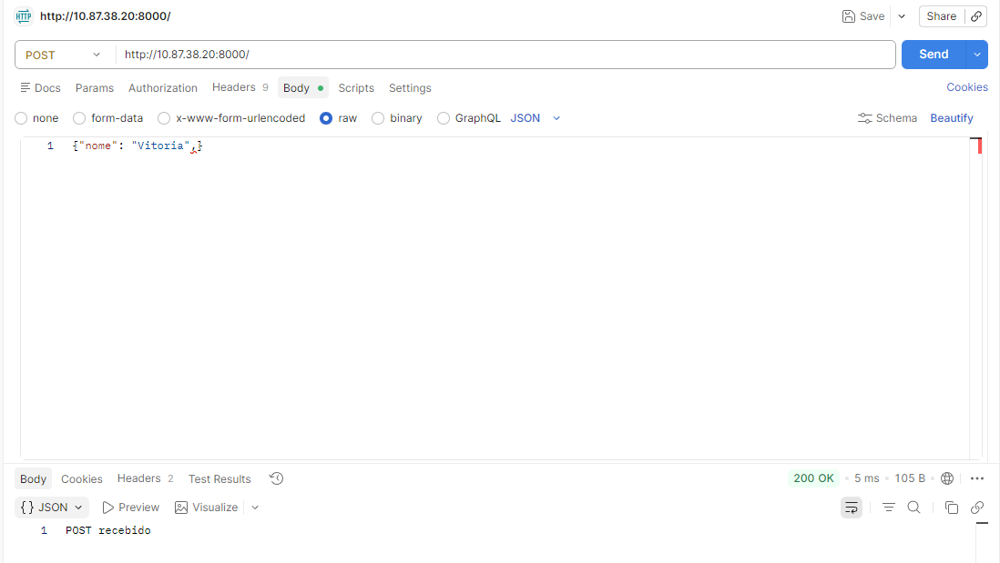
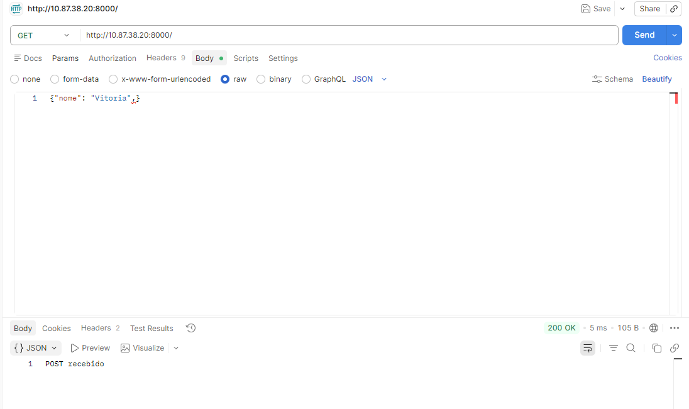
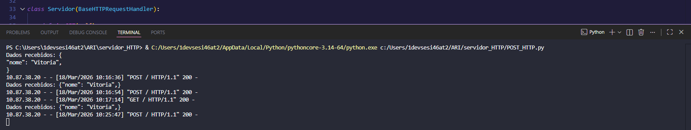

Atividade prática 03 - Criação de servidor HTTP

Este código em Python utiliza a biblioteca padrão http.server para criar um servidor HTTP básico. Ele está dividido em duas partes (uma que aceita GET e POST, e outra simplificada apenas com GET). 

Aqui está a explicação detalhada do que cada comando faz, focando na primeira parte (linhas 1 a 29), que é a mais completa:

## Estrutura do Servidor

- ***from http.server import HTTPServer, BaseHTTPRequestHandler:***
  
  Importa as ferramentas necessárias. O HTTPServer é o "motor" que roda o servidor, e o BaseHTTPRequestHandler é o modelo que define como responder às requisições.

- ***class Servidor(BaseHTTPRequestHandler):***
  
    Cria uma classe chamada Servidor que herda as funções básicas de um servidor web. Você vai customizar os métodos dentro dela.

## Método GET (Linhas 5-9)

Este método lida com pedidos de visualização (como abrir uma página no navegador).

- *def do_GET(self):*
  
  Define o que aocntece quando o servidor recebe uma requisição do tipo GET.
  
- ***self.send_response(200):***
  
  Envia o código de status 200 OK para o cliente (navegador), dizendo que o pedido foi processado com sucesso.

- ***self.end_headers():***
  
  Finaliza a seção de cabeçalhos da resposta HTTP.

- ***self.wfile.write(b"..."):***
  
  Escreve a resposta que será exibida no navegador. O b antes da frase indica que o texto deve ser enviado em formato de bytes.

## Método POST (Linhas 12-27)

Este método lida com o envio de dados para o servidor (como preencher um formulário).

- ***def do_POST(self):***
  
  Define o que acontece quando o servidor recebe uma requisição POST.
  
- ***tamanho = int(self.headers['Content-Length']):***
  
  Lê o cabeçalho para saber quantos bytes de dados o cliente está enviando. Isso é essencial para saber onde parar de ler.

- ***dados = self.rfile.read(tamanho):***
  
  Efetivamente lê o corpo da mensagem (os dados enviados) com base no tamanho descoberto acima.
  
- ***print(..., dados.decode()):***
  
  Exibe no terminal do computador onde o servidor está rodando os dados recebidos. O .decode() transforma os bytes de volta em texto legível.
  
- ***self.send_response(200) e self.end_headers():***
  
  Confirma para o cliente que o POST foi recebido com sucesso.

## Inicialização (Linha 29)

- ***HTTPServer(("0.0.0.0", 8000), Servidor).serve_forever():***

  - ***"0.0.0.0":***
    
    Diz para o servidor escutar em todas as interfaces de rede disponíveis.

  - ***8000:***
    
    É a porta de comunicação.

  - ***Servidor:***
    
    É a classe que você criou com as regras de GET e POST.

  - ***.serve_forever():***
    
    Mantém o servidor rodando continuamente até que você o pare manualmente.

## Requisição e o recebimento da requisição

Foi feito uma requisição POST com o POSTMAN no formato JSON.

Foi feito uma requisição GET com o POSTMAN.

E esse é o servidor recebento as requisições:

